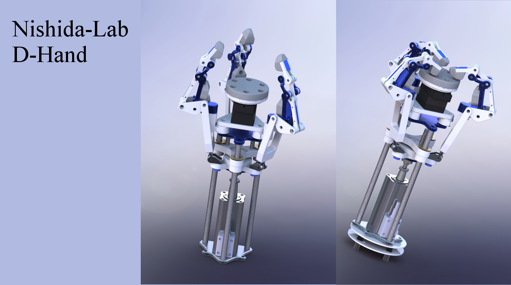

# D-Hand CAD Repository

Welcome !!  
This repository provides D-HAND CAD.  
The hand is created by [DOUBLE Research and Development Co.,LTD](http://www.j-d.co.jp/dhand/dhand_top.html)  
Hand's type is A3M-Servo Motor.  

# LICENSE
New BSD.
See the LICENSE for more info.

# Rendered Image
Now (2016.05.20), compleated !! 


# Inertial Info
### base part
```
座標系: base_frame

質量 = 1.22813391 kilograms

重心: ( ﾒｰﾄﾙ )
	X = 0.08277327
	Y = 0.00019346
	Z = 0.00010419

慣性ﾓｰﾒﾝﾄ: ( kilograms * square meters )
（出力座標系で計算）
	Ixx = 0.00052834	Ixy = 0.00000936	Ixz = 0.00000419
	Iyx = 0.00000936	Iyy = 0.01395061	Iyz = 0.00000326
	Izx = 0.00000419	Izy = 0.00000326	Izz = 0.01395381
```
### finger base part
```

座標系: finger_base_frame

質量 = 0.04234931 kilograms

重心: ( ﾒｰﾄﾙ )
	X = -0.01754268
	Y = -0.00000454
	Z = 0.00865222


慣性ﾓｰﾒﾝﾄ: ( kilograms * square meters )
（出力座標系で計算）
	Ixx = 0.00003568	Ixy = 0.00000000	Ixz = -0.00001443
	Iyx = 0.00000000	Iyy = 0.00005208	Iyz = 0.00000000
	Izx = -0.00001443	Izy = 0.00000000	Izz = 0.00002108
```
### finger middle part
```
座標系: finger_middle_frame

質量 = 0.02332939 kilograms

重心: ( ﾒｰﾄﾙ )
	X = 0.00158657
	Y = 0.01806831
	Z = 0.00009908

慣性ﾓｰﾒﾝﾄ: ( kilograms * square meters )
（出力座標系で計算）
	Ixx = 0.00001418	Ixy = 0.00000220	Ixz = 0.00000000
	Iyx = 0.00000220	Iyy = 0.00000361	Iyz = 0.00000004
	Izx = 0.00000000	Izy = 0.00000004	Izz = 0.00001530
```
### finger top part
```
座標系: finger_top_frame

質量 = 0.01452790 kilograms

重心: ( ﾒｰﾄﾙ )
	X = 0.00147129
	Y = 0.03006940
	Z = 0.00000000

慣性ﾓｰﾒﾝﾄ: ( kilograms * square meters )
（出力座標系で計算）
	Ixx = 0.00001842	Ixy = 0.00000139	Ixz = 0.00000000
	Iyx = 0.00000139	Iyy = 0.00000096	Iyz = 0.00000000
	Izx = 0.00000000	Izy = 0.00000000	Izz = 0.00001830
 ```
### adapter part
```
座標系: adapter_frame

重心(Center Of Mass)と慣性ﾓｰﾒﾝﾄ((Moments of Tensor)の出力に使用される座標系: d-hand-adapted
質量 = 0.09444833 kilograms

重心: ( ﾒｰﾄﾙ )
	X = 0.01836084
	Y = 0.00000000
	Z = 0.00000000

慣性ﾓｰﾒﾝﾄ: ( kilograms * square meters )
（出力座標系で計算）
	Ixx = 0.00008749	Ixy = 0.00000000	Ixz = 0.00000000
	Iyx = 0.00000000	Iyy = 0.00008142	Iyz = 0.00000000
	Izx = 0.00000000	Izy = 0.00000000	Izz = 0.00008142
```